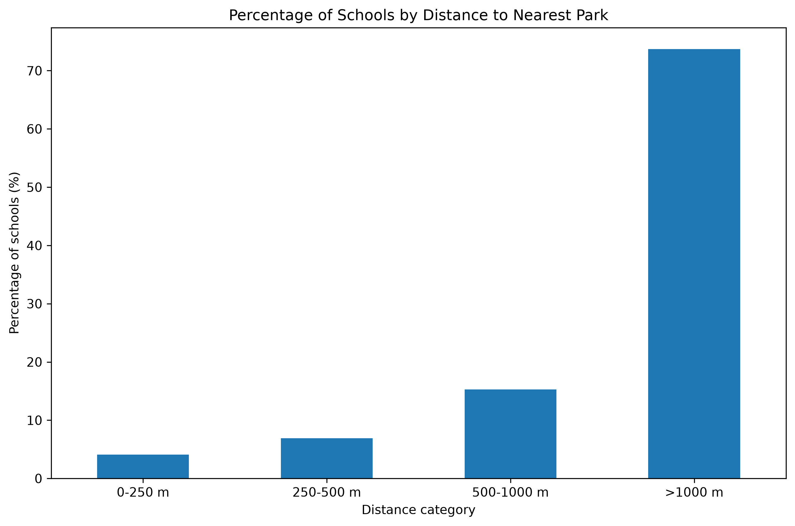
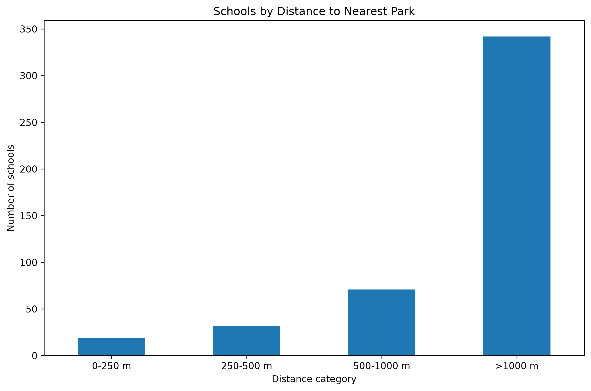
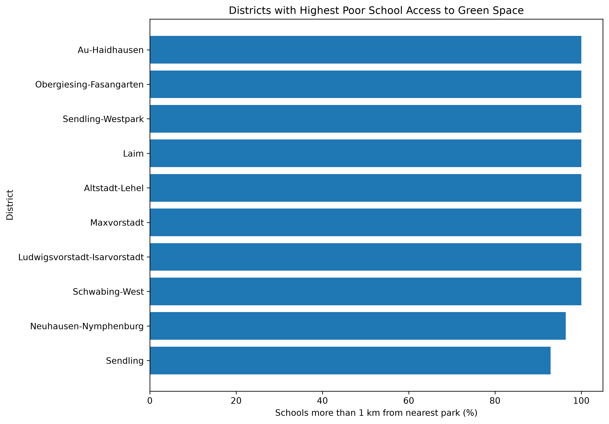
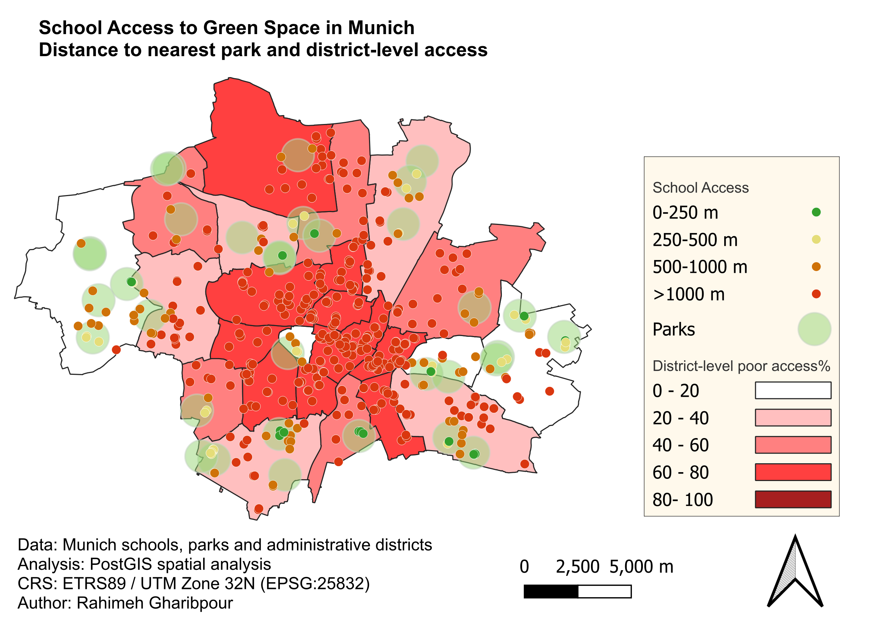

# Munich Green Access Analysis

## Overview

This project analyses the spatial accessibility of green spaces for schools in Munich, Germany.

The analysis investigates the distance between schools and their nearest parks and identifies areas where schools have relatively poor access to green space.

The project demonstrates a complete GIS workflow combining **PostgreSQL/PostGIS, SQL, Python and QGIS**.

---

## Research Question

How accessible are parks to schools across Munich, and which city districts contain the highest proportion of schools located more than 1 km from the nearest park?

---

## Project Objectives

The main objectives of the project are:

* Calculate the distance from each school to its nearest park.
* Classify schools according to their distance from the nearest park.
* Identify schools with relatively poor access to parks.
* Analyse the spatial distribution of school access across Munich districts.
* Aggregate school-level results to the district level.
* Create thematic maps and statistical visualisations.
* Demonstrate a reproducible GIS workflow using PostGIS, SQL, Python and QGIS.

---

## Data Sources

The spatial datasets used in this project were obtained from the
[Bavarian State Office for Surveying (Bayerische Vermessungsverwaltung)
OpenData portal](https://geodaten.bayern.de/opengeodata/).

The project uses datasets covering:
- Schools in Munich
- Parks and green spaces
- Munich administrative districts

The data were processed and analysed using PostgreSQL/PostGIS, Python,
and QGIS.

---

## Technologies

* **PostgreSQL / PostGIS** — spatial database and spatial analysis
* **SQL** — spatial queries, distance calculations and aggregation
* **Python** — data processing and visualisation
* **pandas** — tabular data processing
* **matplotlib** — statistical charts
* **QGIS** — cartography and spatial visualisation
* **Git / GitHub** — version control and project management

---

## Methodology

### 1. Data Preparation

School, park and administrative district datasets were imported into PostgreSQL/PostGIS.

The spatial datasets were prepared for further analysis and stored in a PostGIS database.

### 2. Coordinate Reference System

For distance calculations, the spatial data were transformed to:

**ETRS89 / UTM Zone 32N — EPSG:25832**

A projected coordinate reference system was used so that distances could be calculated in metres.

### 3. School–Park Proximity Analysis

The nearest park distance was calculated for each school using PostGIS spatial functions, including:

* `ST_Distance`
* spatial joins
* aggregation functions
* `MIN()` to identify the nearest park

### 4. School Access Classification

Schools were classified according to their distance to the nearest park:

| Distance to nearest park | Access category |
| ------------------------ | --------------- |
| 0–250 m                  | Very close      |
| 250–500 m                | Close           |
| 500–1000 m               | Moderate        |
| >1000 m                  | Poor access     |

### 5. District-Level Analysis

Each school was spatially joined to its Munich administrative district.

The results were aggregated by district to identify areas with a high proportion of schools located more than 1 km from the nearest park.

### 6. Cartography

The results were visualised in QGIS using:

* graduated district-level symbology
* categorized school points
* park locations
* map legends
* scale bar
* north arrow
* coordinate reference system information

### 7. Python Visualisation

Python was used to create statistical visualisations showing:

* number of schools by access category
* percentage of schools by access category
* districts with the highest proportion of schools with poor access

---

## Key Results

A total of **464 schools** and **34 parks** were included in the analysis.

The average distance from a school to its nearest park was:

**1,626.3 metres**

Minimum distance:

**75.4 metres**

Maximum distance:

**3,717.9 metres**

### School Access Results

| Access category | Number of schools | Percentage |
| --------------- | ----------------: | ---------: |
| 0–250 m         |                19 |       4.1% |
| 250–500 m       |                32 |       6.9% |
| 500–1000 m      |                71 |      15.3% |
| >1000 m         |               342 |      73.7% |
| **Total**       |           **464** |   **100%** |

The analysis shows that **342 of the 464 schools (73.7%) are located more than 1 km from their nearest park**, based on straight-line distance.

---

## Visualisations

### School Access by Distance





### District-Level Poor Access



---

## QGIS Map

The final QGIS map visualises:

* school locations classified by distance to the nearest park
* Munich parks
* district-level percentage of schools with poor access

The map uses **ETRS89 / UTM Zone 32N (EPSG:25832)**.



---

## Main Spatial Analysis Outputs

### School-Level Analysis

* `school_nearest_park`
* `school_green_access`
* nearest park distance
* school access category
* school geometry

### District-Level Analysis

* `school_district_access`
* `district_green_access`
* total number of schools per district
* number of schools with poor access
* percentage of schools with poor access

---

## Project Structure

The repository is organised into the following main components:

* **QGIS/** — QGIS project file
* **data/** — raw spatial datasets
* **maps/** — final visualisations and charts
* **outputs/** — analytical CSV outputs
* **scripts/** — Python scripts for data loading and analysis
* **sql/** — PostGIS spatial analysis queries
* **README.md** — project documentation
* **.gitignore** — Git configuration

```
## Limitations

This analysis measures accessibility based on the **straight-line distance** from each school to its nearest park.

Therefore, the results do not represent actual walking, cycling, or pedestrian accessibility.

The analysis does not consider:

* park size
* park quality
* park facilities
* pedestrian or cycling networks
* physical barriers such as major roads or railway infrastructure
* population distribution
* school capacity or number of students

The results should therefore be interpreted as a **proximity-based indicator of green-space accessibility**, rather than a measure of actual travel accessibility.

---

## Reproducibility

The project follows a structured GIS workflow combining **PostgreSQL/PostGIS, SQL, Python and QGIS**.

The main spatial analysis includes:

* coordinate reference system transformation
* school–park proximity analysis
* nearest park distance calculation
* school access classification
* school–district spatial joins
* district-level aggregation

The project structure separates raw data, processing scripts, SQL analysis, QGIS outputs and visualisations to support a clear and reproducible workflow.

---

## Future Improvements

Potential extensions of the analysis include:

* network-based walking distance instead of straight-line distance
* integration of pedestrian and cycling networks
* consideration of barriers such as major roads and railways
* analysis of park size and facilities
* population and school enrolment analysis
* more detailed accessibility indicators
* interactive web mapping

---

## Author

**Rahimeh Gharibpour**

GIS / Geospatial Analysis
